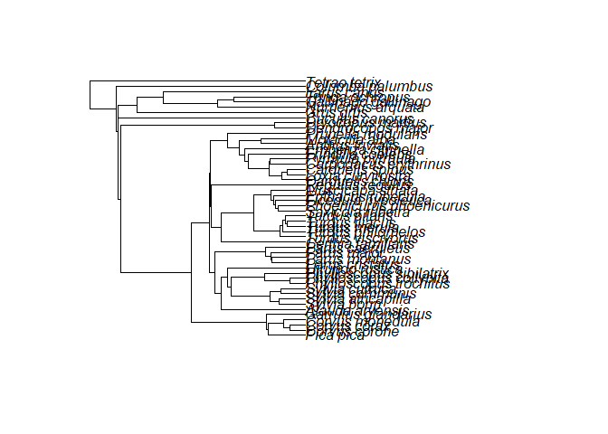
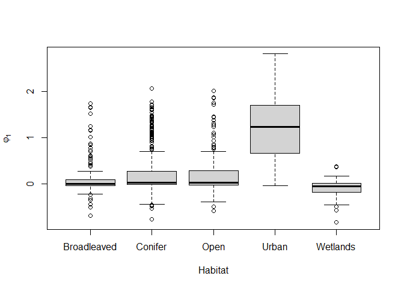
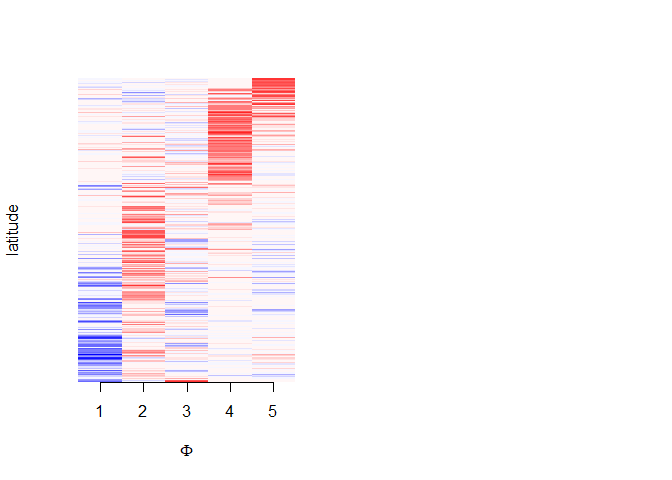
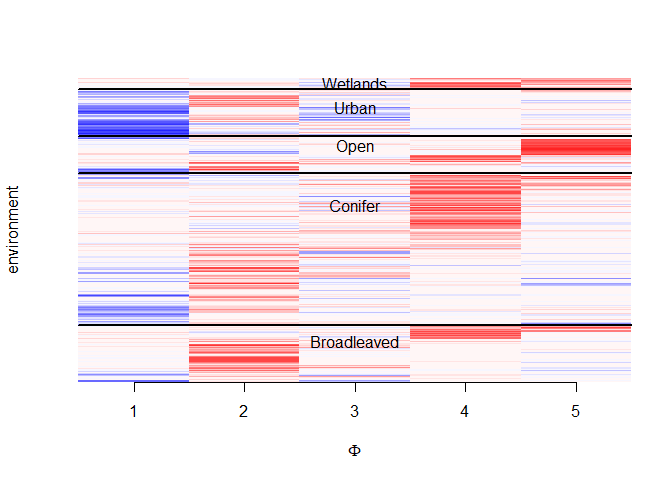
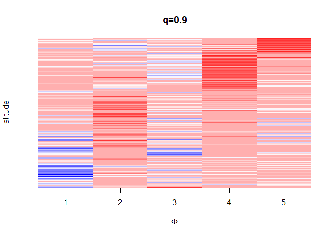
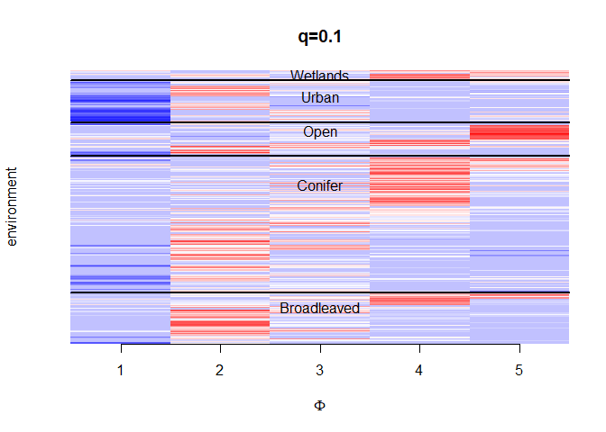
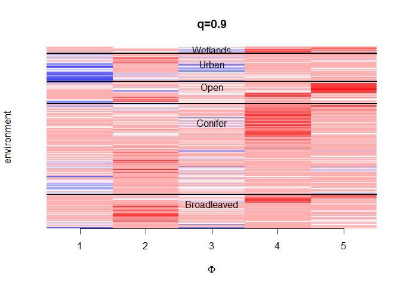

Bird species occurence dataset
================

 
```{}
knitr::opts_chunk$set(echo = TRUE)
```

```{r, echo=FALSE}
library(dplyr)
#source("../../sampler.R")
```
 

## Birds co-occurrence

This script reproduces the analysis of the “birds” dataset (Section
4.1). The dataset contains information on the co-occurrence patterns of
$p=50$ bird species in Finland; data were collected over nine years
(2006-2014) across $S=200$ locations.

In this data analysis exercise, we are interested in fitting a factor
model to analyze the bird species occurrence in a unsupervised manner,
including only the “group” information (observation site), as the APAFA
model foresees.

Then, we will investigate the relation between environmental covariates
available and latent factors found by the model a posteriori

\##Prepare the data

Y is the (nxp) matrix containing the counts (as presence/absence) of
species (p=50) in the S=200 location (group) over time (average group
dimension 4.5).

``` r
da = read.csv( ( "data/data.csv"), stringsAsFactors=TRUE)

colnames(da)[-c(1:9)]
```

    ##  [1] "Phylloscopus_trochilus"  "Turdus_iliacus"         
    ##  [3] "Fringilla_coelebs"       "Turdus_philomelos"      
    ##  [5] "Carduelis_spinus"        "Parus_major"            
    ##  [7] "Anthus_trivialis"        "Erithacus_rubecula"     
    ##  [9] "Cuculus_canorus"         "Muscicapa_striata"      
    ## [11] "Ficedula_hypoleuca"      "Turdus_pilaris"         
    ## [13] "Loxia_curvirostra"       "Columba_palumbus"       
    ## [15] "Sylvia_borin"            "Corvus_corone"          
    ## [17] "Dendrocopos_major"       "Emberiza_citrinella"    
    ## [19] "Turdus_merula"           "Sylvia_curruca"         
    ## [21] "Regulus_regulus"         "Prunella_modularis"     
    ## [23] "Phoenicurus_phoenicurus" "Parus_caeruleus"        
    ## [25] "Parus_montanus"          "Motacilla_alba"         
    ## [27] "Carduelis_chloris"       "Phylloscopus_collybita" 
    ## [29] "Tringa_ochropus"         "Parus_cristatus"        
    ## [31] "Sylvia_communis"         "Grus_grus"              
    ## [33] "Larus_canus"             "Pica_pica"              
    ## [35] "Phylloscopus_sibilatrix" "Turdus_viscivorus"      
    ## [37] "Hirundo_rustica"         "Sylvia_atricapilla"     
    ## [39] "Tetrao_tetrix"           "Pyrrhula_pyrrhula"      
    ## [41] "Dryocopus_martius"       "Certhia_familiaris"     
    ## [43] "Alauda_arvensis"         "Corvus_corax"           
    ## [45] "Saxicola_rubetra"        "Garrulus_glandarius"    
    ## [47] "Numenius_arquata"        "Carpodacus_erythrinus"  
    ## [49] "Gallinago_gallinago"     "Corvus_monedula"

``` r
Y = matrix((da[, -c(1:9)]) > 0, nrow = nrow(da))
Y = apply(Y, MARGIN = 2, FUN = as.numeric)
head(Y)
```

    ##      [,1] [,2] [,3] [,4] [,5] [,6] [,7] [,8] [,9] [,10] [,11] [,12] [,13] [,14]
    ## [1,]    1    1    1    1    1    1    1    1    0     1     1     1     0     0
    ## [2,]    1    1    1    1    1    1    1    1    1     1     1     1     1     1
    ## [3,]    1    1    1    1    1    1    1    1    1     1     1     0     0     1
    ## [4,]    1    0    1    1    1    1    1    1    0     1     1     0     1     1
    ## [5,]    1    1    1    1    1    1    1    1    1     1     1     1     1     0
    ## [6,]    1    1    1    1    1    1    1    1    1     1     1     1     1     1 ....
   

``` r
colnames(Y) = colnames(da)[-c(1:9)]
colnames(Y)
```

    ##  [1] "Phylloscopus_trochilus"  "Turdus_iliacus"         
    ##  [3] "Fringilla_coelebs"       "Turdus_philomelos"      
    ##  [5] "Carduelis_spinus"        "Parus_major"            
    ##  [7] "Anthus_trivialis"        "Erithacus_rubecula"     
    ##  [9] "Cuculus_canorus"         "Muscicapa_striata"      
    ## [11] "Ficedula_hypoleuca"      "Turdus_pilaris"         
    ## [13] "Loxia_curvirostra"       "Columba_palumbus"       
    ## [15] "Sylvia_borin"            "Corvus_corone"          
    ## [17] "Dendrocopos_major"       "Emberiza_citrinella"    
    ## [19] "Turdus_merula"           "Sylvia_curruca"         
    ## [21] "Regulus_regulus"         "Prunella_modularis"     
    ## [23] "Phoenicurus_phoenicurus" "Parus_caeruleus"        
    ## [25] "Parus_montanus"          "Motacilla_alba"         
    ## [27] "Carduelis_chloris"       "Phylloscopus_collybita" 
    ## [29] "Tringa_ochropus"         "Parus_cristatus"        
    ## [31] "Sylvia_communis"         "Grus_grus"              
    ## [33] "Larus_canus"             "Pica_pica"              
    ## [35] "Phylloscopus_sibilatrix" "Turdus_viscivorus"      
    ## [37] "Hirundo_rustica"         "Sylvia_atricapilla"     
    ## [39] "Tetrao_tetrix"           "Pyrrhula_pyrrhula"      
    ## [41] "Dryocopus_martius"       "Certhia_familiaris"     
    ## [43] "Alauda_arvensis"         "Corvus_corax"           
    ## [45] "Saxicola_rubetra"        "Garrulus_glandarius"    
    ## [47] "Numenius_arquata"        "Carpodacus_erythrinus"  
    ## [49] "Gallinago_gallinago"     "Corvus_monedula"

``` r
# We next read the datafile containing species traits, and include in the TrData dataframe data on migratory strategy and body mass
alltraits = read.csv(file.path("data/traits.csv"), stringsAsFactors = TRUE)
cbind(as.character(alltraits[,1]), (colnames(da)[-c(1:9)]))
```

    ##       [,1]                      [,2]                     
    ##  [1,] "Phylloscopus_trochilus"  "Phylloscopus_trochilus" 
    ##  [2,] "Turdus_iliacus"          "Turdus_iliacus"         
    ##  [3,] "Fringilla_coelebs"       "Fringilla_coelebs"      
    ##  [4,] "Turdus_philomelos"       "Turdus_philomelos"      
    ##  [5,] "Carduelis_spinus"        "Carduelis_spinus"       
    ##  [6,] "Parus_major"             "Parus_major"            
    ##  [7,] "Anthus_trivialis"        "Anthus_trivialis"       
    ##  [8,] "Erithacus_rubecula"      "Erithacus_rubecula"     
    ##  [9,] "Cuculus_canorus"         "Cuculus_canorus"        
    ## [10,] "Muscicapa_striata"       "Muscicapa_striata"      
    ## [11,] "Ficedula_hypoleuca"      "Ficedula_hypoleuca"     
    ## [12,] "Turdus_pilaris"          "Turdus_pilaris"         
    ## [13,] "Loxia_curvirostra"       "Loxia_curvirostra"      
    ## [14,] "Columba_palumbus"        "Columba_palumbus"       
    ## [15,] "Sylvia_borin"            "Sylvia_borin"           
    ## [16,] "Corvus_corone"           "Corvus_corone"          
    ## [17,] "Dendrocopos_major"       "Dendrocopos_major"      
    ## [18,] "Emberiza_citrinella"     "Emberiza_citrinella"    
    ## [19,] "Turdus_merula"           "Turdus_merula"          
    ## [20,] "Sylvia_curruca"          "Sylvia_curruca"         
    ## [21,] "Regulus_regulus"         "Regulus_regulus"        
    ## [22,] "Prunella_modularis"      "Prunella_modularis"     
    ## [23,] "Phoenicurus_phoenicurus" "Phoenicurus_phoenicurus"
    ## [24,] "Parus_caeruleus"         "Parus_caeruleus"        
    ## [25,] "Parus_montanus"          "Parus_montanus"         
    ## [26,] "Motacilla_alba"          "Motacilla_alba"         
    ## [27,] "Carduelis_chloris"       "Carduelis_chloris"      
    ## [28,] "Phylloscopus_collybita"  "Phylloscopus_collybita" 
    ## [29,] "Tringa_ochropus"         "Tringa_ochropus"        
    ## [30,] "Parus_cristatus"         "Parus_cristatus"        
    ## [31,] "Sylvia_communis"         "Sylvia_communis"        
    ## [32,] "Grus_grus"               "Grus_grus"              
    ## [33,] "Larus_canus"             "Larus_canus"            
    ## [34,] "Pica_pica"               "Pica_pica"              
    ## [35,] "Phylloscopus_sibilatrix" "Phylloscopus_sibilatrix"
    ## [36,] "Turdus_viscivorus"       "Turdus_viscivorus"      
    ## [37,] "Hirundo_rustica"         "Hirundo_rustica"        
    ## [38,] "Sylvia_atricapilla"      "Sylvia_atricapilla"     
    ## [39,] "Tetrao_tetrix"           "Tetrao_tetrix"          
    ## [40,] "Pyrrhula_pyrrhula"       "Pyrrhula_pyrrhula"      
    ## [41,] "Dryocopus_martius"       "Dryocopus_martius"      
    ## [42,] "Certhia_familiaris"      "Certhia_familiaris"     
    ## [43,] "Alauda_arvensis"         "Alauda_arvensis"        
    ## [44,] "Corvus_corax"            "Corvus_corax"           
    ## [45,] "Saxicola_rubetra"        "Saxicola_rubetra"       
    ## [46,] "Garrulus_glandarius"     "Garrulus_glandarius"    
    ## [47,] "Numenius_arquata"        "Numenius_arquata"       
    ## [48,] "Carpodacus_erythrinus"   "Carpodacus_erythrinus"  
    ## [49,] "Gallinago_gallinago"     "Gallinago_gallinago"    
    ## [50,] "Corvus_monedula"         "Corvus_monedula"

``` r
rownames(alltraits) # 50 species: matches the p=50 columns of the Y matrix
```

    ##  [1] "1"  "2"  "3"  "4"  "5"  "6"  "7"  "8"  "9"  "10" "11" "12" "13" "14" "15"
    ## [16] "16" "17" "18" "19" "20" "21" "22" "23" "24" "25" "26" "27" "28" "29" "30"
    ## [31] "31" "32" "33" "34" "35" "36" "37" "38" "39" "40" "41" "42" "43" "44" "45"
    ## [46] "46" "47" "48" "49" "50"

``` r
TrData = data.frame(Species = alltraits$Species, Migration=alltraits$Migration, LogMass = log(alltraits$Mass))
# scale the numeric data
TrData$LogMass = scale(TrData$LogMass)


# X and Traits formulae
XFormula = ~ hab + poly(clim, degree = 2,raw = TRUE) -1
TrFormula = ~ Migration + LogMass -1


# we now should find groups of birds defined by the philogenetic tree
#install.packages("ape")
library(ape)
phyloTree = read.tree("data/CTree.tre")
plot(phyloTree)
```

<!-- -->

``` r
# from pica pica to prunella modularis (40) we have the same order: passeriformes
# dendrocopos_major and dryocopus_martius has order piciformes
#  Cuculiformes
#  gruiformes
#  Charadriiformes
#  Columbiformes
#  tetrao tetrix
# 7 different orders with one of them that has 40 elements: not so beautiful.

# to separate the big group we can consider the family or superfamily
# 1-5 corvidae
# 6-18 Sylvioidea
# 19 Certhioidea
# 20-29 muscicapoidea
# 30 rguloidea
# 31-40 passeroidea
# an alternative is using
# corvidae (5) - Sylvioidea (13) - muscicapoidea (10) - passeroidea (10) as further variables.
# we can decide to ignore or consider also picidae (2) - Scolopacidae (3)

# Finally we identified 4 or 6 group variables (depending if we ignore the smallest groups or not).

# New TrData

corvoidea =  sylvioidea = muscicapoidea = passeroidea = picidae = scolopacidae = rep(0, 50)
corvoidea[which(colnames(Y) %in% phyloTree$tip.label[1:5])] = 1
sylvioidea[which(colnames(Y) %in% phyloTree$tip.label[6:18])] = 1
muscicapoidea[which(colnames(Y) %in% phyloTree$tip.label[20:29])] = 1
passeroidea[which(colnames(Y) %in% phyloTree$tip.label[31:40])] = 1
picidae[which(colnames(Y) %in% phyloTree$tip.label[41:42])] = 1
scolopacidae[which(colnames(Y) %in% phyloTree$tip.label[45:47])] = 1

TrData_taxonomy = data.frame(TrData,
                             corvoidea,
                             sylvioidea,
                             muscicapoidea,
                             passeroidea,
                             picidae,
                             scolopacidae)
TrFormula_taxonomy = ~ Migration + LogMass + corvoidea +
  sylvioidea + muscicapoidea + passeroidea + picidae + scolopacidae - 1
TrData_taxonomy[, 4]
```

    ##  [1] 0 0 0 0 0 0 0 0 0 0 0 0 0 0 0 1 0 0 0 0 0 0 0 0 0 0 0 0 0 0 0 0 0 1 0 0 0 0
    ## [39] 0 0 0 0 0 1 0 1 0 0 0 1

## Prepare data to fit the model

``` r
# maximum number of factors
d = 10
k = 10
p = ncol(Y)

ns = table(da$Route) # units in each study
S = length(unique(da$Route)) # studies
n = sum(ns) # total units in all studies

#shared latent loadings and factors
shared_loadings = rnorm(p * d, sd = 1)
Lambda = matrix(shared_loadings, ncol = d, nrow = p)
Lambda
```

    ##              [,1]         [,2]        [,3]         [,4]        [,5]        [,6]
    ##  [1,]  0.20589449  0.611195653  0.12010808 -0.441184581  0.14515944 -0.28035366
    ##  [2,]  1.96056990  1.689903915 -0.82941873 -0.193474759 -1.19395843  0.59018113
    ##  [3,]  2.03999321 -1.326404288  1.44284575 -1.077562030 -0.53375750  0.76033383
    ##  [4,]  1.01545160  0.413659113  0.53384278  1.147093754  1.00564512 -0.49410208
    ##  [5,] -1.41792769 -0.008187162  1.78710055  0.943229252  0.39305628  0.07022077
    ##  [6,] -1.12765950  0.083935192  0.50510860  0.173388136  0.77408813  1.36463087
    ##  [7,]  2.49006955 -0.118692320 -1.43749979 -1.894970324 -1.99748862  1.07779210
    ##  [8,]  1.04743997 -0.778330233 -0.52880565 -0.464263505 -0.72736915  1.55075965
    ##  [9,]  0.49615037  1.811470477 -1.08430087  0.939859005  0.82489460 -1.93147026
    ## [10,] -0.03776979 -2.100636147 -0.99076331 -0.107025433 -1.49983413  0.76620785
    ## [11,] -1.63973722  0.932243383  0.44435664 -0.395431954 -1.60983574 -1.14515861
    ## [12,] -0.57705836 -0.247235182 -0.23389690  1.932151836  0.68929357 -0.12749856
    ## [13,]  0.16146851  1.011487412  1.66133115  0.189449680  0.29934269  0.76725718
    ## [14,]  0.41521516  0.459630860 -1.20234075  0.669797458 -1.28742442 -1.73212586
    ## [15,]  0.76958363 -0.283103754  0.07710205 -1.206590000  1.18218212 -0.40856465
    ...

``` r
eta = matrix(NA, ncol = d, nrow = n)
for (h in 1:d) {
  eta[, h] = rnorm(n)
}
# specific active factors
ks = c(rep(1, S))#specific factors study (important just for the ground truth in simulations)
ks[cumsum(ks) > k] = 0 # set some factors to "inactive"
sum(ks)
```

    ## [1] 10

``` r
#assign group labels (location labels)
group = rep(NA, n)
for (s in 1:S) {
  nscumpre = ifelse(s > 1, sum(ns[1:(s - 1)]) + 1, 1)
  nscum = sum(ns[1:s])
  group[nscumpre:nscum] = s
}
group
```

    ##   [1]   1   1   1   1   2   2   2   2   2   3   3   3   3   3   3   3   4   4
    ##  [19]   4   4   4   4   4   5   5   5   5   5   6   6   6   6   7   7   7   7
    ##  [37]   8   8   8   8   9   9   9   9   9   9  10  10  10  10  10  11  11  11
    ##  [55]  11  11  11  11  12  12  12  12  12  12  13  13  13  13  13  13  13  13
    ##  [73]  13  14  14  14  14  14  14  14  15  15  15  15  16  16  16  16  16  16
    ##  [91]  16  17  17  17  17  18  18  18  18  18  19  19  19  19  19  20  20  20
    ## [109]  20  20  21  21  21  21  21  22  22  22  22  23  23  23  23  23  24  24
    ## [127]  24  24  25  25  25  25  25  25  25  26  26  26  26  26  27  27  27  27
    ## [145]  27  28  28  28  28  28  29  29  29  29  29  30  30  30  30  31  31  31
    ## [163]  31  32  32  32  32  33  33  33  33  33  34  34  34  34  35  35  35  35
    ...

``` r
table(group)
```

    ## group
    ##   1   2   3   4   5   6   7   8   9  10  11  12  13  14  15  16  17  18  19  20 
    ##   4   5   7   7   5   4   4   4   6   5   7   6   9   7   4   7   4   5   5   5 
    ##  21  22  23  24  25  26  27  28  29  30  31  32  33  34  35  36  37  38  39  40 
    ##   5   4   5   4   7   5   5   5   5   4   4   4   5   4   5   4   7   5   4   6 
    ##  41  42  43  44  45  46  47  48  49  50  51  52  53  54  55  56  57  58  59  60 
    ...

``` r
# convert into dummy variables the group labels
X = matrix(NA, ncol = S, nrow = n)
X[, 1:S] = model.matrix(rep(1, n) ~ -1 + as.factor(group))

# initialize specific loadings and factors
specific_loadings = rnorm(p * k, sd = 1)
Gamma = matrix(specific_loadings, ncol = k, nrow = p)
phi_ = phi = matrix(NA, ncol = k, nrow = n)
for (h in 1:k) {
  phi[, h] = phi_[, h] = rnorm(n)
}
for (i in 1:n){
for (h in 1:k) {
  phi[i, h] = phi_[i, h] * (group[i] == h) # set 0s blocks of different groups
}
}
head(phi,9)
```

    ##              [,1]       [,2] [,3] [,4] [,5] [,6] [,7] [,8] [,9] [,10]
    ##  [1,] -1.11550728  0.0000000    0    0    0    0    0    0    0     0
    ##  [2,]  0.69465200  0.0000000    0    0    0    0    0    0    0     0
    ##  [3,]  0.02872015  0.0000000    0    0    0    0    0    0    0     0
    ##  [4,]  1.02850162  0.0000000    0    0    0    0    0    0    0     0
    ##  [5,]  0.00000000 -0.8470869    0    0    0    0    0    0    0     0
    ##  [6,]  0.00000000 -0.6122160    0    0    0    0    0    0    0     0
    ##  [7,]  0.00000000 -0.6076651    0    0    0    0    0    0    0     0
    ##  [8,]  0.00000000 -0.4008893    0    0    0    0    0    0    0     0
    ##  [9,]  0.00000000  0.8520305    0    0    0    0    0    0    0     0

## Set prior hyperparameters

``` r
alpha_eta = 5 # number of active shared factors a priori
v_eta = c(rbeta(d - 1, shape1 = 1, shape2 = alpha_eta), 1)
w_eta = v_eta * c(1, cumprod(1 - v_eta[-d]))                     # weights
z_eta = rep(d, d)
alpha_phi = 5 # number of active specific factors a priori
v_phi = c(rbeta(k - 1, shape1 = 1, shape2 = alpha_phi), 1)
w_phi = v_phi * c(1, cumprod(1 - v_phi[-k]))                     # weights
z_phi = rep(k, k)
whichgroup = unique(sapply(1:n , function (k)
  (which(X[k, ] == 1))))

# initailize regression coefficients for modelling the specific factors' activation pattern
# based on group labels
betas = matrix(0, ncol = k, nrow = S)
```

## define the state of the MCMC chain

``` r
state = list(
  y = Y,
  # response
  Lambda = Lambda + rnorm(prod(dim(Lambda))),
  Lambda_ = Lambda + rnorm(prod(dim(Lambda)), sd =0.1),
  # shared loadings
  eta = (eta),
  # shared factors
  Gamma = Gamma + rnorm(prod(dim(Gamma)), sd = 0.1),
  #specific loadings
  phi = (phi) ,
  phi_ = (phi_) + rnorm(prod(dim(phi_)), sd = 0.1),
  #sparse and non sparse specific factors
  # list of specific covariance matrices
  n = n,
  ns = ns,
  X = X,
  S = S,
  d = d,
  k = k,
  p = p,
  #prior
  a_lambda = 1,
  b_lambda = 2,
  a_gamma = 1,
  b_gamma = 2,
  tau_eta = c(c(rep(1, 10)), c(rep(0, d - 10))),
  tau_phi = c(c(rep(1, 10)), c(rep(0, k - 10))),
  z_eta = z_eta,
  z_phi = z_phi,
  w_eta = w_eta,
  w_phi = w_phi,
  v_eta = v_eta,
  v_phi = v_phi,
  alpha_eta = 5,
  alpha_phi = 5,
  # equal tO expected n.of active factors
  betas = betas,
  ps = matrix(rbinom(n * k, 1, 0.1), ncol = k)
)

copy_state = state
```

## Run the Gibbs sampler

``` r
Gaussian = F
#pre-allocate memory for results
maxiter = 1
ris_phi = array(dim = c(maxiter, dim(state$phi)))
ris_eta = array(dim = c(maxiter, dim(state$eta)))
ris_th = array(dim = c(maxiter, dim(state$th)))
ris_ps = array(dim = c(maxiter, dim(state$ps)))

ris_beta = array(dim = c(maxiter, dim(state$betas)))
ris_eta = array(dim = c(maxiter, dim(state$eta)))
ris_lambda = array(dim = c(maxiter, dim(state$Lambda)))
ris_gamma = array(dim = c(maxiter, dim(state$Gamma)))
ris_tau_eta = array(dim = c(maxiter, length(state$tau_eta)))
ris_tau_phi = array(dim = c(maxiter, length(state$tau_phi)))

set.seed(111)

maxiter=10000
#maxiter=10000
iter=1
run=F
if (run==T){
for (iter in 1:maxiter) {
  cat(iter)
  state = Gibbs_Kernel_non_gauss(state)
  #shrinkage tau
  ris_tau_eta[iter, ] = state$tau_eta
  ris_tau_phi[iter, ] = state$tau_phi
  #factors
  ris_phi[iter, , ] = state$phi
  ris_eta[iter, , ] = state$eta
 
  #beta
  ris_beta[iter, , ] = state$betas

  #local activation psi
  ris_ps[iter, , ] = state$ps
 
  #loadings
  ris_lambda[iter, , ] = state$Lambda
  ris_gamma[iter, , ] = state$Gamma
 
  #print iteration and number of active factors
  if(iter%%100==0){
    print(state$tau_eta)
    print(state$tau_phi)
    }
}
}
#save.image("birds_results.RData")
```

# Upload results

``` r
load("birds_results.RData")
```

``` r
par(mfrow=c(1,1))
#specific factors vs type of habitat
levels(da[,6])=c("Broadleaved","Conifer","Open","Urban","Wetlands")
for (i in 6:6) plot(colMeans(ris_phi[5000:10000,,1])~da[,i],
                    xlab=colnames(da)[i],ylab=expression(varphi[1]))
```

<!-- -->

Posterior mean of the factors ordering units by latitude

``` r
# Define the matrix to be visualized 
# Define the color palette with red and blue
custom_colors <- c("red","white", "blue")

# Create a custom color function that maps values to colors
color_function <- colorRampPalette(custom_colors)
colors <- color_function(0.3*length(GG1))
 
#head(colMeans((ris_phi[5000:10000,,])*ris_ps[5000:10000,,]))

par(mfrow=c(1,2))
image(t(colMeans((ris_phi[5000:10000,,1:5])*
                    ris_ps[5000:10000,,1:5])),
ylab="latitude", col =colors, axes=F , xlab = expression(Phi))
axis(1,0.25*c(1:5)-0.25, 1:5)
```

<!-- -->

Posterior mean ordering by latitude and habitat

``` r
oor=order(da$Habitat)
cuts=table(da$Habitat[oor])/sum(table(da$Habitat[oor]))
image(t(colMeans((ris_phi[5000:10000,oor,1:5])*
                   ris_ps[5000:10000,oor,1:5])),
      ylab="environment", col =colors, axes=F , xlab = expression(Phi))
abline(h=cumsum(cuts)*1.01-0., lwd=2.985)
axis(1,0.25*c(1:5)-0.25, 1:5)
text(.5,cumsum(cuts)-0.012*c(4,8,2,4,1),c("Broadleaved", "Conifer", "Open", "Urban","Wetlands"))
```

<!-- -->

Upper and lower bounds of credible intervals for specific factors

``` r
colQuant90=function (m) apply(m,c(2,3), function(x) quantile(x,0.9))
colQuant10=function (m)apply(m,c(2,3),function(x) quantile(x,0.1))

par(mfrow=c(1,2))

image(t(colQuant10((ris_phi[5000:10000,,1:5])*
                   ris_ps[5000:10000,,1:5]))
      ,  main="q=0.1",
      ylab="latitude", col =colors, axes=F , xlab = expression(Phi))
axis(1,0.25*c(1:5)-0.25, 1:5)
```

<!-- -->

``` r
image(t(colQuant90((ris_phi[5000:10000,,1:5])*
                     ris_ps[5000:10000,,1:5])),
      main="q=0.9",
      ylab="latitude", col =colors, axes=F , xlab = expression(Phi))
axis(1,0.25*c(1:5)-0.25, 1:5)
```

<!-- -->

``` r
colQuant90=function (m) apply(m,c(2,3), function(x) quantile(x,0.9))
colQuant10=function (m)apply(m,c(2,3),function(x) quantile(x,0.1))


 

image(t(colQuant10((ris_phi[5000:10000,oor,1:5])*
                     ris_ps[5000:10000,oor,1:5]))
      ,  main="q=0.1",
      ylab="environment", col =colors, axes=F , xlab = expression(Phi))
abline(h=cumsum(cuts)*1.01-0., lwd=2.985)
axis(1,0.25*c(1:5)-0.25, 1:5)
text(.5,cumsum(cuts)-0.012*c(4,8,2,4,1),c("Broadleaved", "Conifer", "Open", "Urban","Wetlands"))
```

<!-- -->

``` r
image(t(colQuant90((ris_phi[5000:10000,oor,1:5])*
                     ris_ps[5000:10000,oor,1:5])),
      main="q=0.9",
      ylab="environment", col =colors, axes=F , xlab = expression(Phi))
abline(h=cumsum(cuts)*1.01-0., lwd=2.985)
axis(1,0.25*c(1:5)-0.25, 1:5)
text(.5,cumsum(cuts)-0.012*c(4,8,2,4,1),c("Broadleaved", "Conifer", "Open", "Urban","Wetlands"))
```

<!-- -->

``` r
# covariance matrix
G=colMeans(colMeans(ris_tau_phi[5000:10000, ])*(ris_gamma[5000:10000,, ]))
G
```

    ##              [,1]          [,2]         [,3]         [,4]        [,5]
    ##  [1,]  1.42339442 -1.3615038239  0.004461156 -1.800490362 -0.73783587
    ##  [2,]  0.67965061 -1.1538778315  0.292678587 -0.869366216 -0.35406064
    ##  [3,]  1.42703049 -1.2678069733 -0.082215852 -0.560396485  1.07491704
    ##  [4,]  0.80751092 -1.3399529564 -0.028331256 -1.221098934  0.45734470
    ##  [5,]  0.82003146 -1.1664052105 -0.071927281 -1.294006618  0.73455631
    ##  [6,]  1.61826991 -0.9197783581 -0.016520694 -0.154234617  0.77875839
    ##  [7,]  0.54367477 -1.2050684256 -0.002772315 -1.058337386  0.95207151
    ##  [8,]  1.02891489 -1.2092645875 -0.140548517 -0.183039893  1.00452862
    ...
    
``` r
L=colMeans(colMeans(ris_tau_eta[5000:10000, ])*
             (ris_lambda[5000:10000,, ]))
L
```

    ##                [,1]         [,2]         [,3]         [,4]          [,5] [,6]
    ##  [1,]  3.271290e-01 -0.203280953  0.269712611 -0.030921149 -0.0069605111    0
    ##  [2,]  1.464034e-01 -0.033748143  0.170645717 -0.118301748 -0.1103905525    0
    ##  [3,]  4.090885e-01 -0.237096810  0.301220304  0.003082606  0.0226637175    0
    ##  [4,]  3.175262e-01 -0.295249364  0.355387881  0.017732554  0.0120651572    0
    ##  [5,]  3.022904e-01 -0.232184122  0.287777642  0.084107991  0.0279528883    0
    ##  [6,]  2.886941e-01 -0.136578882  0.262234951 -0.017330104  0.0032615398    0
    ...
    
    ##       [,7] [,8] [,9] [,10]
    ##  [1,]    0    0    0     0
    ##  [2,]    0    0    0     0
    ##  [3,]    0    0    0     0
    ##  [4,]    0    0    0     0
    ##  [5,]    0    0    0     0
    ##  [6,]    0    0    0     0
    ...
    

``` r
#### cov
LL <- tcrossprod(L, L)

ordine <- 50*as.numeric(as.factor(TrData_taxonomy$Migration=="R"))+
  100*as.numeric(as.factor(TrData_taxonomy$Migration)=="S")+
  150*as.numeric(as.factor(TrData_taxonomy$Migration)=="L")+
  as.numeric((TrData_taxonomy$LogMass))
ordine=order(ordine)
```


