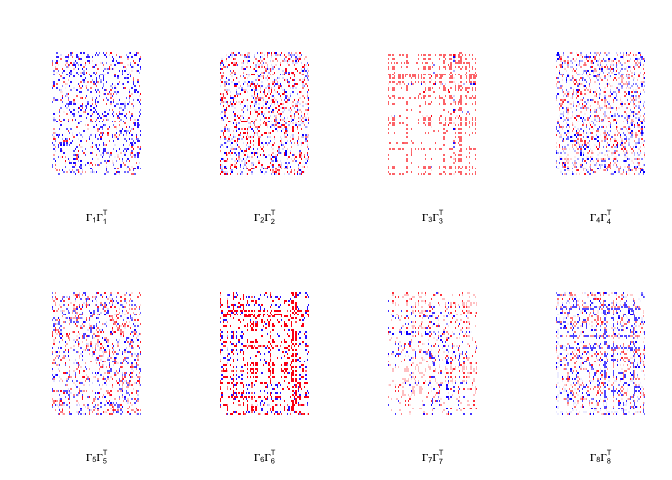
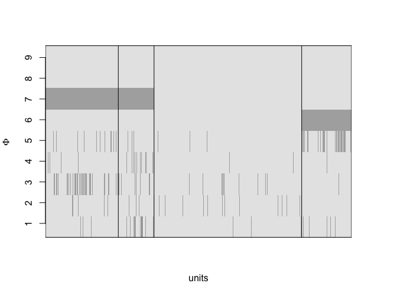
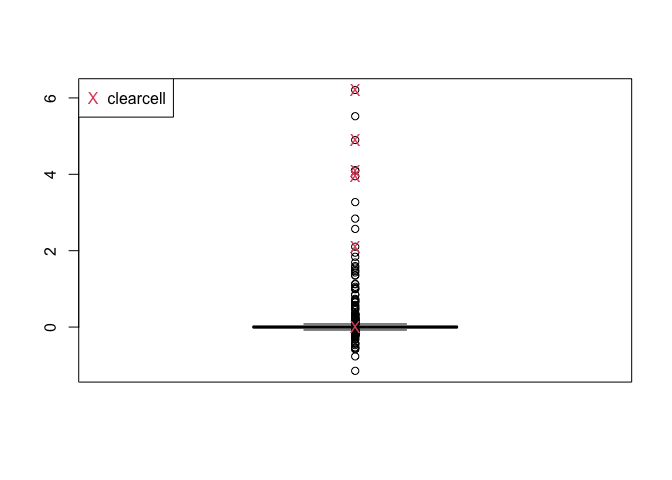
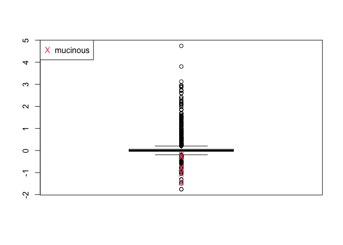
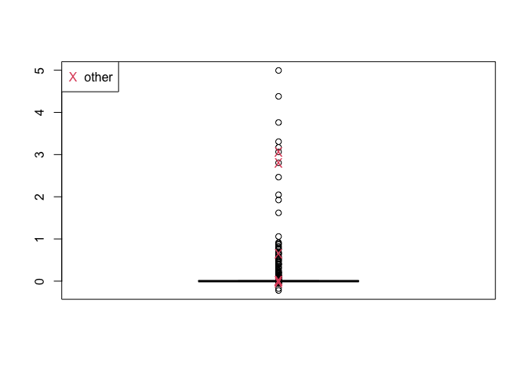
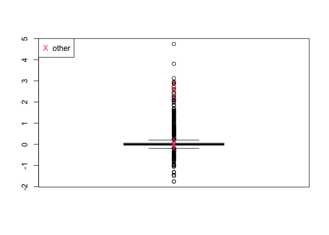
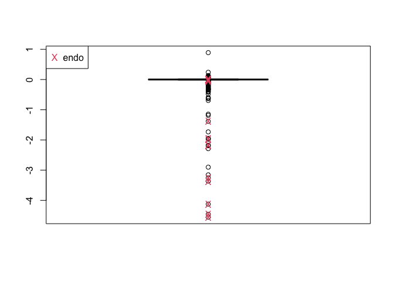

Immune dataset
================
Bortolato, E. and Canale, A.
October 2025

## Data loading and preprocessing

We start by loading the gene expression count dataset, saved as an RDS
file. In addition, we load curated ovarian cancer datasets from the
curatedOvarianData Bioconductor package, which provide patient
information for further modeling and model diagnostics.

``` r
y <- readRDS(file = "immune_data.RDS")

library(curatedOvarianData)
```

    ## Loading required package: Biobase

    ## Loading required package: BiocGenerics

    ## 
    ## Attaching package: 'BiocGenerics'

    ## The following objects are masked from 'package:stats':
    ## 
    ##     IQR, mad, sd, var, xtabs

    ## The following objects are masked from 'package:base':
    ## 
    ##     anyDuplicated, aperm, append, as.data.frame, basename, cbind,
    ##     colnames, dirname, do.call, duplicated, eval, evalq, Filter, Find,
    ##     get, grep, grepl, intersect, is.unsorted, lapply, Map, mapply,
    ##     match, mget, order, paste, pmax, pmax.int, pmin, pmin.int,
    ##     Position, rank, rbind, Reduce, rownames, sapply, saveRDS, setdiff,
    ##     table, tapply, union, unique, unsplit, which.max, which.min

    ## Welcome to Bioconductor
    ## 
    ##     Vignettes contain introductory material; view with
    ##     'browseVignettes()'. To cite Bioconductor, see
    ##     'citation("Biobase")', and for packages 'citation("pkgname")'.

``` r
data("GSE9891_eset")
ns = dim(GSE9891_eset)[2]
data("GSE20565_eset")
ns = c(ns, dim(GSE20565_eset)[2])
data(TCGA_eset)
ns = c(ns, dim(TCGA_eset)[2])
data("GSE26712_eset")
ns = c(ns, dim(GSE26712_eset)[2])
data("GSE20565_eset")

p <- ncol(y)
n <- nrow(y)
sum(ns) == n
```

    ## [1] TRUE

``` r
S <- 4
```

------------------------------------------------------------------------

## Parameter initialization

We initialize parameters for the APAFA model. Shared latent factors are
initially extracted using principal component analysis, and specific
factors are defined per study.  
Group indicators and design matrices are created to encode study
membership.

``` r
Sigma <- (diag(p)) * 0.5
fact_est <- princomp(y, scores = TRUE)
d <- 30  # number of shared latent factors
Lambda <- matrix(fact_est$loadings[, 1:d], ncol = d, nrow = p)
eta <- eta_ <- matrix(NA, ncol = d, nrow = n)

for (h in 1:d) {
  eta[, h] <- eta_[, h] <- fact_est$scores[h]
}

ks <- c(3, 3, 3, 3)
k <- sum(ks)
group <- rep(NA, n)

for (s in 1:S) {
  nscumpre <- ifelse(s > 1, sum(ns[1:(s-1)]) + 1, 1)
  nscum <- sum(ns[1:s])
  group[nscumpre:nscum] <- s
}

X <- model.matrix(rep(1, n) ~ -1 + as.factor(group))
```

We next define study-specific loadings and initialize hyperparameters
for the prior distributions.  
Stick-breaking weights are drawn to control sparsity in both shared and
specific factors.

``` r
specific_loadings <- rnorm(p * k, sd = 1)
Gamma <- matrix(specific_loadings, ncol = k, nrow = p)
phi_ <- phi <- matrix(NA, ncol = k, nrow = n)
for (h in 1:k) { phi[, h] <- phi_[, h] <- rnorm(n) }

alpha_eta <- 5
v_eta <- c(rbeta(d - 1, 1, alpha_eta), 1)
w_eta <- v_eta * c(1, cumprod(1 - v_eta[-d]))
z_eta <- rep(d, d)

alpha_phi <- 6
v_phi <- c(rbeta(k - 1, 1, alpha_phi), 1)
w_phi <- v_phi * c(1, cumprod(1 - v_phi[-k]))
z_phi <- rep(k, k)

betas <- matrix(0, ncol = k, nrow = S)
plogis(betas)
```

    ##      [,1] [,2] [,3] [,4] [,5] [,6] [,7] [,8] [,9] [,10] [,11] [,12]
    ## [1,]  0.5  0.5  0.5  0.5  0.5  0.5  0.5  0.5  0.5   0.5   0.5   0.5
    ## [2,]  0.5  0.5  0.5  0.5  0.5  0.5  0.5  0.5  0.5   0.5   0.5   0.5
    ## [3,]  0.5  0.5  0.5  0.5  0.5  0.5  0.5  0.5  0.5   0.5   0.5   0.5
    ## [4,]  0.5  0.5  0.5  0.5  0.5  0.5  0.5  0.5  0.5   0.5   0.5   0.5

Finally, we define priors, hyperparameters, and initialize arrays for
MCMC storage.  
The code below sets up all model components required by the Gibbs
sampler.

``` r
a_lambda <- 2
b_lambda <- 2
a_gamma <- 2
b_gamma <- 2
a_load <- c(rep(a_lambda, d), rep(a_gamma, k))
b_load <- c(rep(b_lambda, d), rep(b_gamma, k))

state <- list(
  y = y,
  Lambda = Lambda, Lambda_ = Lambda,
  eta = eta,
  Gamma = Gamma,
  phi = phi, phi_ = phi_,
  Sigma = Sigma,
  n = n, ns = ns, X = X, S = S, d = d, k = k, p = p,
  a_sigma = 2, b_sigma = 2,
  tau_eta = c(rep(1, d), rep(0, d - d)),
  tau_phi = c(rep(1, k), rep(0, k - k)),
  z_eta = z_eta, z_phi = z_phi,
  w_eta = w_eta, w_phi = w_phi,
  v_eta = v_eta, v_phi = v_phi,
  alpha_eta = 10, alpha_phi = 6,
  scale_beta = 0.1,
  a_load = a_load, b_load = b_load,
  betas = betas,
  ps = matrix(rbinom(n * k, 1, 0.5), ncol = k)
)

maxiter <- 10000

ris_phi <- array(dim = c(maxiter, dim(state$phi)))
ris_eta <- array(dim = c(maxiter, dim(state$eta)))
ris_ps <- array(dim = c(maxiter, dim(state$ps)))
ris_beta <- array(dim = c(maxiter, dim(state$betas)))
ris_lambda <- array(dim = c(maxiter, dim(state$Lambda)))
ris_gamma <- array(dim = c(maxiter, dim(state$Gamma)))
ris_tau_eta <- array(dim = c(maxiter, length(state$tau_eta)))
ris_tau_phi <- array(dim = c(maxiter, length(state$tau_phi)))
ris_sigma1 <- matrix(0, ncol = p, maxiter)
```

The Gibbs sampler can now be run to estimate the posterior
distributions.  
Set `run = TRUE` to execute the sampler; otherwise, skip to
post-processing using precomputed results.

``` r
iter <- 1
set.seed(1234)
run <- FALSE

if (run == TRUE) {
  for (iter in iter:maxiter) {
    cat(iter)
    state <- Gibbs_Kernel(state)
    ris_tau_eta[iter, ] <- state$tau_eta
    ris_tau_phi[iter, ] <- state$tau_phi
    ris_phi[iter, , ] <- state$phi
    ris_eta[iter, , ] <- state$eta
    ris_beta[iter, , ] <- state$betas
    ris_ps[iter, , ] <- state$ps
    ris_lambda[iter, , ] <- state$Lambda
    ris_gamma[iter, , ] <- state$Gamma
    ris_sigma1[iter, ] <- diag(state$Sigma)

    if (iter %% 200 == 0) {
      print(iter)
    }
  }
}

if (run == TRUE) save.image("immune_res.RData")
```

------------------------------------------------------------------------

## Post-processing analysis

If the MCMC was already run, we load the saved workspace and perform
posterior summaries and visualizations.  
We begin by loading the precomputed results.

``` r
if (run==F) load("immune_res.RData")
```

### Reproducing Figure 9: contribution of ΓΓᵀ

We estimate the contribution of the study-specific components by
averaging posterior samples of the corresponding parameters.  
The following code computes the contribution matrices and visualizes
them using color-coded heatmaps.

``` r
G = colMeans(colMeans(ris_tau_phi[5000:10000, ]) * (ris_gamma[5000:10000, , ]))
ps_hat = apply(ris_ps, c(2, 3), mean)
phi_hat = apply(ris_phi[5000:10000, , ], c(2, 3), mean)

order(colSums(abs(phi_hat)))
```

    ##  [1]  9 10 11 12  4  8  1  2  6  5  3  7

``` r
G = G[, order(colSums(abs(phi_hat)))]

GG1 = tcrossprod(G[, 1], G[, 1])
GG2 = tcrossprod(G[, 2], G[, 2])
GG3 = tcrossprod(G[, 3], G[, 3])
GG4 = tcrossprod(G[, 4], G[, 4])
GG5 = tcrossprod(G[, 5], G[, 5])
GG6 = tcrossprod(G[, 6], G[, 6])
GG7 = tcrossprod(G[, 7], G[, 7])
GG8 = tcrossprod(G[, 8], G[, 8])
GG9 = tcrossprod(G[, 9], G[, 9])

custom_colors <- c("red", "white", "blue")
color_function <- colorRampPalette(custom_colors)
colors <- color_function(0.3 * length(GG1))

par(mfrow = c(2, 4))
image(GG3, axes = FALSE, xlab = expression(Gamma[1] * Gamma[1]^T), col = colors[sort.list(t(GG3))])
image(GG4, axes = FALSE, xlab = expression(Gamma[2] * Gamma[2]^T), col = colors[sort.list(GG4)])
image(GG5, axes = FALSE, xlab = expression(Gamma[3] * Gamma[3]^T), col = colors[sort.list(GG5)])
image(GG1, axes = FALSE, xlab = expression(Gamma[4] * Gamma[4]^T), col = colors[sort.list(GG1)])
image(GG2, axes = FALSE, xlab = expression(Gamma[5] * Gamma[5]^T), col = colors[sort.list(GG2)])
image(GG6, axes = FALSE, xlab = expression(Gamma[6] * Gamma[6]^T), col = colors[sort.list(GG6)])
image(GG7, axes = FALSE, xlab = expression(Gamma[7] * Gamma[7]^T), col = colors[sort.list(GG7)])
image(GG8, axes = FALSE, xlab = expression(Gamma[8] * Gamma[8]^T), col = colors[sort.list(GG8)])
```

<!-- -->

------------------------------------------------------------------------

## Figure 7: estimated activation of specific factors

We visualize the estimated activation probabilities (`phi_hat`) across
samples and studies.  
Grey-scale images highlight variation across units-factors, with
vertical lines distinguishing betweeen studies.

``` r
ps_hat = apply(ris_ps, c(2, 3), mean)
phi_hat = apply(ris_phi[8000:10000, , ], c(2, 3), mean)

par(mfrow = c(1, 1))
par(mar = c(4, 4, 4, 4))
image(1 - (phi_hat[, 1:9]), axes = FALSE, col = grey.colors(3),
      xlab = "units", ylab = expression(Phi))
abline(v = cumsum(ns / n))
y = 1:9
axis(2, at = y / 9 * 1.091 - 0.1, labels = 1:9)
abline(v = 0)
abline(h = 1.06)
abline(h = -0.06)
```

<!-- -->

------------------------------------------------------------------------

## Exploratory analysis by histological subtype

We explore the relationship between estimated factors histological
subtypes and site of the tumor across the studies.  
The following code enables to visualize distributions of selected
factors,  
and highlights groups of units that present specific characteristics.

``` r
#histological type
hist = c(GSE9891_eset$histological_type, GSE20565_eset$histological_type,
         TCGA_eset$histological_type, GSE26712_eset$histological_type)
boxplot(phi_hat[, 1])
points(c(1, 1, 1, 1, 1, 1), phi_hat[which(hist == "clearcell"), 1], col = 2, pch = "X")
legend("topleft", "clearcell", pch = "X", col = 2)
```

<!-- -->

``` r
boxplot(phi_hat[, 3])
points(rep(1, 7), phi_hat[which(hist == "mucinous"), 3], col = 2, pch = "X")
legend("topleft", "mucinous", pch = "X", col = 2)
```

<!-- -->

``` r
boxplot(phi_hat[, 4])
points(rep(1, 7), phi_hat[which(hist == "other"), 4], col = 2, pch = "X")
legend("topleft", "other", pch = "X", col = 2)
```

<!-- -->

``` r
#site of the tumor
site = c(GSE9891_eset$primarysite, GSE20565_eset$primarysite,
         TCGA_eset$primarysite, GSE26712_eset$primarysite)
boxplot(phi_hat[, 3])
points(c(1, 1, 1, 1, 1, 1, 1, 1), phi_hat[which(site == "ft"), 3], col = 2, pch = "X")
legend("topleft", "other", pch = "X", col = 2)
```

<!-- -->

``` r
boxplot(phi_hat[, 8])
points(rep(1, 26), phi_hat[which(hist == "endo"), 8], col = 2, pch = "X")
legend("topleft", "endo", pch = "X", col = 2)
```

<!-- -->
