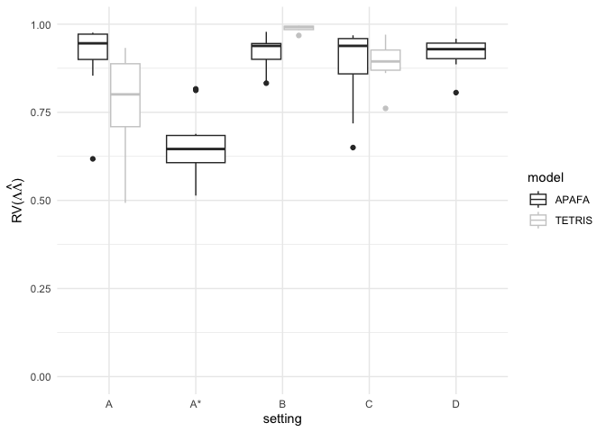
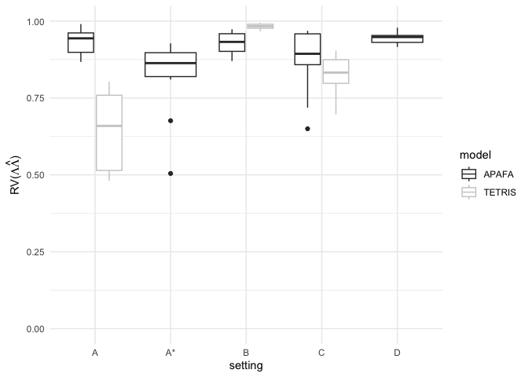
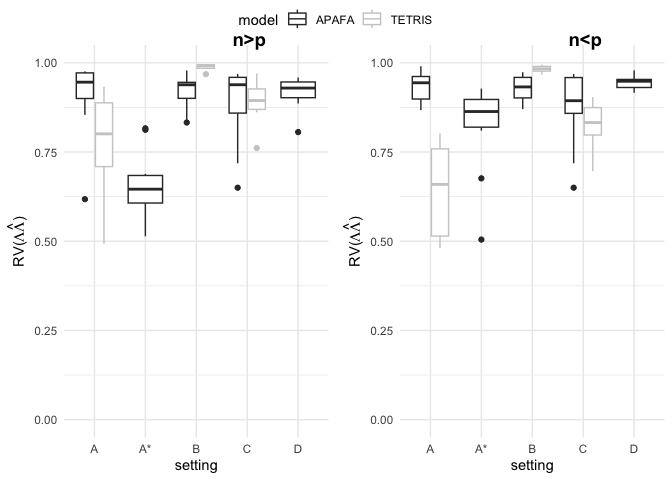

Simulation results
================

This code reproduces Tables 1 and 2 and Figure 4:

``` r
rm(list = ls())
library(dplyr)
```

    ## 
    ## Attaching package: 'dplyr'

    ## The following objects are masked from 'package:stats':
    ## 
    ##     filter, lag

    ## The following objects are masked from 'package:base':
    ## 
    ##     intersect, setdiff, setequal, union

``` r
library(ggplot2)
library(ggpubr)
setwd("simulation")

RIS1 = readRDS("long/RIS_1.RDS")
RIS2 = readRDS("long/RIS_2.RDS")
RIS3 = readRDS("long/RIS_3.RDS")
RIS4A = readRDS("long/RIS_4A.RDS")
RIS4B = readRDS("long/RIS_4B.RDS")

RIS1TETRIS = readRDS("long/RIS1_TETRIS.RDS")
RIS2TETRIS = readRDS("long/RIS2_TETRIS.RDS")
RIS4ATETRIS = readRDS("long/RIS4A_TETRIS.RDS")

OUT_ALL = rbind(RIS1,
                RIS3,
                RIS2,
                RIS4A,
                RIS4B,
                RIS1TETRIS,
                RIS2TETRIS,
                RIS4ATETRIS)

#len is the number of all the replications in the simualtion study
len = c(
  dim(RIS1)[1],
  dim(RIS3)[1],
  dim(RIS2)[1],
  dim(RIS4A)[1],
  dim(RIS4B)[1],
  dim(RIS1TETRIS)[1],
  dim(RIS2TETRIS)[1],
  dim(RIS4ATETRIS)[1]
)

#labels refer to the SCENARIOS (first APAFA, then TETRIS)
labels = c("A", "A*", "B", "C", "D", # APAFA
           "A", "B", "C")# TETRIS
method = c("APAFA",
           "APAFA",
           "APAFA",
           "APAFA",
           "APAFA",
           "TETRIS",
           "TETRIS",
           "TETRIS")
# repeat the labels according to the number of replication in each scenario
setting = unlist(sapply(1:8, function (x)
  rep(labels[x], each = len[x])))

# repeat the method according to the number of replication in each scenario
model = unlist(sapply(1:8, function (x)
  rep(method[x], each = len[x])))
OUT_ALL = cbind(OUT_ALL, setting, model)
colnames(OUT_ALL)[1]="hat d"
colnames(OUT_ALL)[2]="hat k"
colnames(OUT_ALL)[3]="Omega1"
colnames(OUT_ALL)[4]="Omega2"
colnames(OUT_ALL)[5]="Omega3"

table1=(OUT_ALL[,-c(6:9)])
table1=data.frame(table1)
for (col in 1:5)table1[,col]=as.numeric(table1[,col])


summary_tab1 <- table1 %>%
  group_by(model, setting) %>%
  summarise(
    Omega1_mean = round(mean(Omega1),2),
    Omega1_IQR = round(-quantile(Omega1, 0.25)+ quantile(Omega1, 0.75),2),

    Omega2_mean = round(mean(Omega2),2),
    Omega2_IQR = round(-quantile(Omega2, 0.25)+ quantile(Omega2, 0.75),2),

    Omega3_mean = round(mean(Omega3),2),
    Omega3_IQR = round(-quantile(Omega3, 0.25)+ quantile(Omega3, 0.75),2),
    .groups = "drop"
  )

summary_tab1 
```

    ## # A tibble: 8 × 8
    ##   model  setting Omega1_mean Omega1_IQR Omega2_mean Omega2_IQR Omega3_mean
    ##   <chr>  <chr>         <dbl>      <dbl>       <dbl>      <dbl>       <dbl>
    ## 1 APAFA  A              0.89       0.06        0.87       0.07        0.88
    ## 2 APAFA  A*             0.71       0.13        0.75       0.08        0.74
    ## 3 APAFA  B              0.93       0.03        0.93       0.03        0.93
    ## 4 APAFA  C              0.88       0.05        0.78       0.03        0.92
    ## 5 APAFA  D              0.9        0.03        0.85       0.08        0.81
    ## 6 TETRIS A              0.81       0.24        0.81       0.16        0.79
    ## 7 TETRIS B              0.88       0.12        0.85       0.05        0.87
    ## 8 TETRIS C              0.74       0.11        0.75       0.09        0.79
    ## # ℹ 1 more variable: Omega3_IQR <dbl>

``` r
OUT_ALL = as.data.frame(OUT_ALL)
str(OUT_ALL)
```

    ## 'data.frame':    79 obs. of  11 variables:
    ##  $ hat d   : chr  "3" "4" "3" "2" ...
    ##  $ hat k   : chr  "3.3055" "4" "3.0115" "4" ...
    ##  $ Omega1  : chr  "0.899743663689815" "0.902803949066525" "0.944010855243016" "0.916385815000724" ...
    ##  $ Omega2  : chr  "0.908218963583666" "0.931932550313969" "0.855504350786155" "0.875381280396344" ...
    ##  $ Omega3  : chr  "0.868517297072134" "0.9124008506239" "0.938406031284123" "0.896989460056982" ...
    ##  $ V6      : chr  "0.764467026384889" "0.685349964125155" "0.89917513352322" "0.412835138844691" ...
    ##  $ V7      : chr  "0.78276379001579" "0.877648305146948" "0.794775980059151" "0.448460716876684" ...
    ##  $ V8      : chr  "0.776074122121364" "0.791827001319719" "0.520308882911106" "0.75865730305266" ...
    ##  $ norm_eta: chr  "0.974245809474357" "0.959241670805219" "0.974127731199562" "0.617831660857297" ...
    ##  $ setting : chr  "A" "A" "A" "A" ...
    ##  $ model   : chr  "APAFA" "APAFA" "APAFA" "APAFA" ...

``` r
OUT_ALL$norm_eta = as.numeric(OUT_ALL$norm_eta)

plot1 = ggplot2::ggplot(OUT_ALL, aes(x = setting, y = norm_eta, color =
                                       model)) +
  geom_boxplot() +
  coord_cartesian(ylim = c(0, 1.0)) +
  theme_minimal() +
  scale_color_grey() +
  ylab(expression("RV(" * Lambda * hat(Lambda) * ")"))
```

``` r
plot1
```

<!-- -->

``` r
#######################################################
# do the same for the large scenario (n<p)
setwd("simulation")
RIS1LARGE = readRDS("large/RIS1LARGE.RDS")
RIS2LARGE = readRDS("large/RIS_2_large.RDS")
RIS3LARGE = readRDS("large/RIS_3_large.RDS")
RIS4ALARGE = readRDS("large/RIS_4A_large.RDS")
RIS4BLARGE = readRDS("large/RIS_4B_large.RDS")


RIS1TETRIS = readRDS("large/RIS1TETRIS_large.RDS")
RIS2TETRIS = readRDS("large/RIS2TETRIS_large.RDS")
RIS4ATETRIS = readRDS("large/RIS4ATETRIS_large.RDS")

OUT_ALL = rbind(
  RIS1LARGE,
  RIS3LARGE,
  RIS2LARGE,
  RIS4ALARGE,
  RIS4BLARGE,
  RIS1TETRIS,
  RIS2TETRIS,
  RIS4ATETRIS
)


# as before, define the number of replication for each scenario
len = c(
  dim(RIS1LARGE)[1],
  dim(RIS3LARGE)[1],
  dim(RIS2LARGE)[1],
  dim(RIS4ALARGE)[1],
  dim(RIS4BLARGE)[1],
  dim(RIS1TETRIS)[1],
  dim(RIS2TETRIS)[1],
  dim(RIS4ATETRIS)[1]
)
labels = c("A", "A*", "B", "C", "D", # APAFA
           "A", "B", "C") #TETRIS
setting = rep(labels , len)
method = c("APAFA",
           "APAFA",
           "APAFA",
           "APAFA",
           "APAFA",
           "TETRIS",
           "TETRIS",
           "TETRIS")
model = rep(method , len)
OUT_ALL = cbind(OUT_ALL, setting, model)

colnames(OUT_ALL)[1]="hat d"
colnames(OUT_ALL)[2]="hat k"
colnames(OUT_ALL)[3]="Omega1"
colnames(OUT_ALL)[4]="Omega2"
colnames(OUT_ALL)[5]="Omega3"

table2=(OUT_ALL[,-c(6:9)])
table2=data.frame(table2)
for (col in 1:5)table2[,col]=as.numeric(table2[,col])


summary_tab2 <- table2 %>%
  group_by(model, setting) %>%
  summarise(
    Omega1_mean = round(mean(Omega1),2),
    Omega1_IQR = round(-quantile(Omega1, 0.25)+ quantile(Omega1, 0.75),2),

    Omega2_mean = round(mean(Omega2),2),
    Omega2_IQR = round(-quantile(Omega2, 0.25)+ quantile(Omega2, 0.75),2),

    Omega3_mean = round(mean(Omega3),2),
    Omega3_IQR = round(-quantile(Omega3, 0.25)+ quantile(Omega3, 0.75),2),
    .groups = "drop"
  )

summary_tab2 
```

    ## # A tibble: 8 × 8
    ##   model  setting Omega1_mean Omega1_IQR Omega2_mean Omega2_IQR Omega3_mean
    ##   <chr>  <chr>         <dbl>      <dbl>       <dbl>      <dbl>       <dbl>
    ## 1 APAFA  A              0.91       0.09        0.8        0.1         0.63
    ## 2 APAFA  A*             0.85       0.06        0.85       0.05        0.84
    ## 3 APAFA  B              0.93       0.06        0.93       0.06        0.93
    ## 4 APAFA  C              0.87       0.08        0.79       0.04        0.91
    ## 5 APAFA  D              0.89       0.01        0.91       0.03        0.88
    ## 6 TETRIS A              0.78       0.09        0.81       0.15        0.83
    ## 7 TETRIS B              0.87       0.08        0.89       0.05        0.85
    ## 8 TETRIS C              0.7        0.07        0.71       0.13        0.76
    ## # ℹ 1 more variable: Omega3_IQR <dbl>

``` r
OUT_ALL = as.data.frame(OUT_ALL)
str(OUT_ALL)
```

    ## 'data.frame':    80 obs. of  11 variables:
    ##  $ hat d   : chr  "5" "5" "5" "5" ...
    ##  $ hat k   : chr  "4" "5" "4.0035" "4" ...
    ##  $ Omega1  : chr  "0.983195452156752" "0.852859241572611" "0.84444064600998" "0.924564186056271" ...
    ##  $ Omega2  : chr  "0.829559200200942" "0.728551632502827" "0.65059006690506" "0.763619222585638" ...
    ##  $ Omega3  : chr  "0.562827408497495" "0.541759849581587" "0.877218858893239" "0.513085732411489" ...
    ##  $ normGG1 : chr  "0.970401754311807" "0.948899006874598" "0.968160672522697" "0.918605607040756" ...
    ##  $ normGG2 : chr  "0.512900099242118" "0.489598571990839" "0.512490568737199" "0.455921004574808" ...
    ##  $ normGG3 : chr  "0.00654003572536102" "0.0148840989638982" "0.0101536114889753" "0.0325784352039017" ...
    ##  $ norm_eta: chr  "0.990278429318513" "0.89156817838838" "0.9074761400184" "0.955464218311026" ...
    ##  $ setting : chr  "A" "A" "A" "A" ...
    ##  $ model   : chr  "APAFA" "APAFA" "APAFA" "APAFA" ...

``` r
OUT_ALL$norm_eta = as.numeric(OUT_ALL$norm_eta)
plot2 = ggplot2::ggplot(OUT_ALL, aes(x = setting, y = norm_eta, color =
                                       model)) +
  geom_boxplot() +
  theme_minimal() + scale_color_grey() +
  coord_cartesian(ylim = c(0, 1)) +
  ylab(expression("RV(" * Lambda * hat(Lambda) * ")"))

plot2
```

<!-- -->

``` r
ggpubr::ggarrange(
  plot1,
  plot2,
  common.legend = T,
  ncol = 2,
  labels = c("n>p", "n<p"),
  vjust = 0.6,
  hjust = -6.9,
  font.label = 1
)
```

<!-- -->
